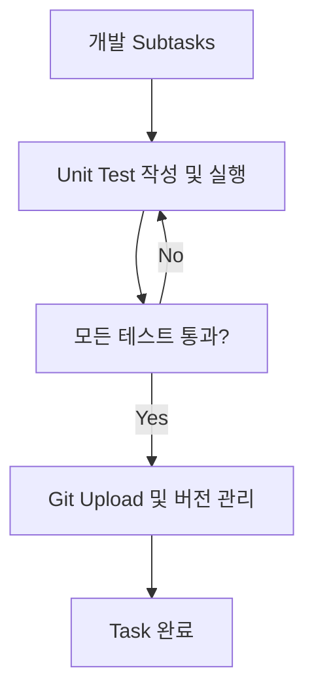

# 표준 Task Template 📋

## 🎯 **모든 개발 Task의 표준 구조**

사용자 제안을 반영하여 **각 task는 반드시 마지막 2개 subtask로 Unit Test와 Git Upload를 포함**해야 합니다.

---

## 📝 **표준 Task Subtask 구조**

### 1️⃣ **개발 Subtasks** (기능별로 추가)
- 실제 기능 구현 관련 subtask들
- 분석, 설계, 구현, 리뷰 등

### 2️⃣ **Unit Test Subtask** (필수 - 두 번째 마지막)
```
Title: Unit Test 작성 및 실행 - [기능명]
Description: [Unit Test Subtask Template 사용]
Dependencies: [모든 개발 subtask들]
```

### 3️⃣ **Git Upload Subtask** (필수 - 마지막)
```
Title: Git Upload 및 버전 관리 - [기능명]
Description: [Git Upload Subtask Template 사용]
Dependencies: [Unit Test Subtask ID]
```

---

## 🔄 **Task 완료 워크플로우**



### ✅ **완료 조건:**
1. ✅ **모든 개발 subtask 완료**
2. ✅ **Unit Test 통과** (커버리지 80% 이상)
3. ✅ **Git에 성공적으로 업로드** (push 완료)

---

## 🚀 **새로운 Task 생성 가이드**

### 1단계: 기본 Task 생성
```bash
task-master add-task --prompt="[기능 설명]" --priority="[high/medium/low]"
```

### 2단계: 개발 Subtasks 추가
```bash
task-master expand --id=[TASK_ID] --research
# 또는 수동으로
task-master add-subtask --parent=[TASK_ID] --title="[개발 subtask]"
```

### 3단계: Unit Test Subtask 추가 (필수)
```bash
task-master add-subtask --parent=[TASK_ID] --title="Unit Test 작성 및 실행 - [기능명]" --description="[Unit Test Template 내용]" --dependencies="[개발 subtask IDs]"
```

### 4단계: Git Upload Subtask 추가 (필수)
```bash
task-master add-subtask --parent=[TASK_ID] --title="Git Upload 및 버전 관리 - [기능명]" --description="[Git Upload Template 내용]" --dependencies="[Unit Test Subtask ID]"
```

---

## 📋 **Task Template 예시**

### Task: "Chart Widget 구현"
```
Subtasks:
1. Chart Widget 설계 및 분석
2. Chart Model 클래스 구현  
3. Chart Provider 상태 관리 구현
4. Chart UI Widget 구현
5. Chart Widget 통합 및 테스트
6. Unit Test 작성 및 실행 - Chart Widget ⭐ (필수)
7. Git Upload 및 버전 관리 - Chart Widget ⭐ (필수)
```

### Dependencies:
- Subtask 6은 1~5에 의존
- Subtask 7은 6에 의존

---

## 🎯 **정책 요약**

### ✅ **사용자 제안 완전 적용:**
1. **Unit Test는 각 task의 subtask로 포함** ✅
2. **Git Upload도 각 task의 subtask로 포함** ✅
3. **별도 task 생성하지 않음** ✅
4. **체계적이고 일관된 워크플로우** ✅

### 🔄 **워크플로우 장점:**
- **명확한 완료 조건**: 테스트 + Git 업로드 = Task 완료
- **자동 품질 보장**: 모든 기능에 테스트가 포함됨
- **버전 관리 일관성**: 모든 변경사항이 추적됨
- **관리 단순화**: task별로 묶여서 관리 용이

---

## 📚 **관련 템플릿 문서**
- [Unit Test Subtask Template](.taskmaster/templates/unit_test_subtask_template.md)
- [Git Upload Subtask Template](.taskmaster/templates/git_upload_subtask_template.md)

---
*Standard Template Version: 2.0*
*Updated: 2025년 10월 2일*
*Includes: Unit Test + Git Upload Subtasks (User Request)*